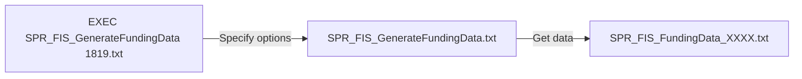

## Summary
The FIS Funding Summariser can be used to transform a FIS database into a single table that is simple and fast to report on that can hold multiple FIS datasets at the same time.

The functionality is contained within 3 stored procedures:
| Stored Procedure | Purpose |
|--|--|
| EXEC SPR_FIS_GenerateFundingData 1819.txt | This is the file used to generate a FIS summary where you specify options such as where the FIS file is located  |
| SPR_FIS_GenerateFundingData.txt | Called by the exec stored procedure above and responsible for either creating/re-creating the data table or emptying out existing data ready for re-insertion
| SPR_FIS_FundingData_XXXX.txt | Called by the stored procedure above (where XXXX is the academic year) and is responsible for outputting the data from the FIS so it can be inserted into the data table by this procedure

## Setting Up

Use the SQL Server import tool to import a FIS MDB file into SQL Server.
> It is good to stick to a convention for naming the files such as **FIS_XXYY_RAA** where XXYY is the academic year and AA is the ILR return contained in the MDB - i.e. **FIS_1819_R04**. (If uploading weekly you may want add a number onto the end and thenF to indicate the final return for that period - i.e. **FIS_1819_R04_F**)

Firstly create the tables that are required:
| Table | Purpose |
|--|--|
| FIS_Faculties Create Table | Creates the table where faculty names can be held |
| FIS_Teams Create Table | Creates the table where team names can be held |

Now create the stored procedures by running the scripts:

 - SPR_FIS_FundingData_1718
 - SPR_FIS_FundingData_1819
 - SPR_FIS_FundingData_1920
 - SPR_FIS_GenerateFundingData

Now lastly run the EXEC script to trigger the process that will export data from the FIS MDB and insert it into a new table called **FIS_FundingData**

This has various parameters. These are explained below.

## Running the FIS Funding Summariser
The funding summariser is run by copying and pasting the code contained within the exec statement, customising this as appropriate by setting the options below:

TODO